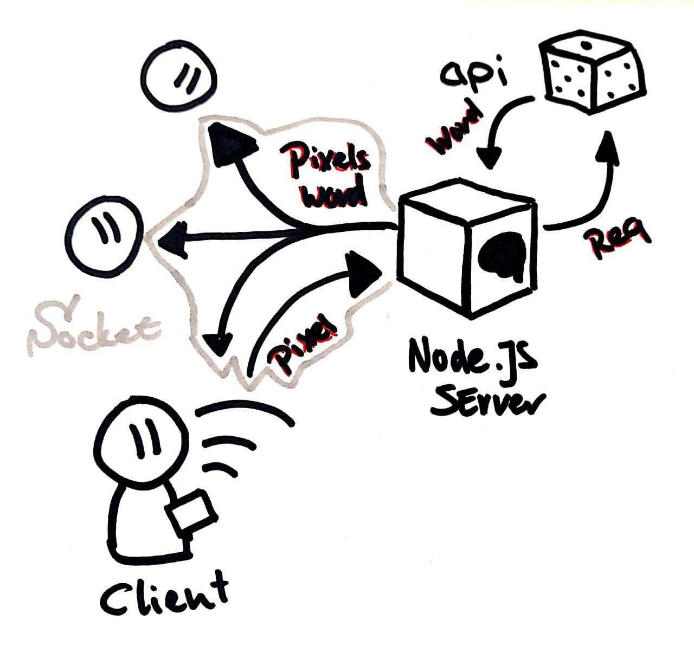

# Let's draw stuff! 🎨

## Installing the app

The app already runs 🔥 [here](letsdrawstuff.herokuapp.com) 🔥.
However if you want to run the build locally you can run:
```bash
    # Install packages
    $ npm i
```
```bash
    # Run Gulp to build file changes
    $ gulp watch
```
```bash
    # Boot the server
    $ nodemon server.js
    # or
    $ npm start
```

## About this project 

This app is a multi-user drawing grid. Here you can draw and "Login" to create some pixel art together.

The app provides the topics, you have a 60s window to create the pixelart!

## Dependencies used to run this app

- Node.js
- Express
- Socket.io
- EJS
- Gulp.js (tooling)

## Data cycle



## Api
[**Roger's random object generator**](http://roger.redevised.com/)
This api generates random object without the obsecure words.

>## Why?
>If your application needs a random object, you probably don't want obscure words (e.g. enfilade) or things that are not even objects.
>## Everyday Items
>Roger gives you everyday items, things that have form and function.

## Data

This app uses roughly 2 types of data,
1. *API* data
2. *USER* generated data

### API
The api data in itself is minimal, but it has no other need then to supply the subject for the drawings.

The API uses a `REST` interface and returns us with a string.
```
   > Lipstick
   > Water Bottle
```

### USER
The user generated data is a bit more complex.
The user is "logged" in by signing up with a user name.
Afterwards the user can draw when there are at least **2** people present.
You can draw on the grid by simply clicking or draging.
Each pixel that is updated is send to the server and send back to the other users in real time.

After a 60s interval, a snapshot is created on the client and "saved". The canvas is then cleared and a new topic is supplied.

Sample data:
```Javascript
    // User registration
    {
        user: "Senpaizuri", 
        color: "#be3f00"
    }
    // Pixel updates
    {
        pos:{
            x: 22, 
            y: 10
        }, 
        pixel:{
            r: 0,   
            g: 198, 
            b: 0, 
            a: 255
        }
    }
```
## // Sidenotes

### Data Model on the server

I tried to push the pixel updates to the server but ran into multiple problems.

The canvas can be abstracted to an `Array` from the `canvas.getImageData(x,y)`. However this is only getter data. You *cannot* directly set it to be something else.
You however can loop through each value and change it that way.

When I tried this approach of setting each array value the array came out botched with the right values in the wrong places.

Since I also had to push the individual pixels to the array it became to much I put it on the backlog for another time.

## Wishlist

- [x] Better support for user input changes
- [x] Better draw support
- [x] Clientside Snapshots
- [ ] Mobile touch support
- [ ] Serverside data presistance
- [ ] Serverside Snapshots
- [ ] Proper save mechanism
